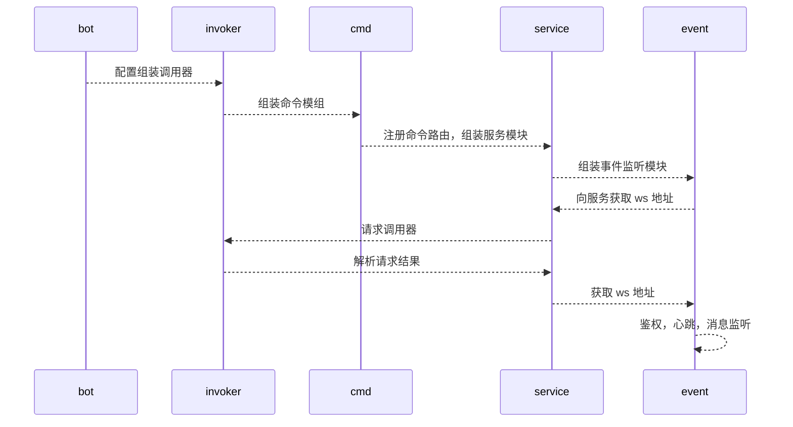
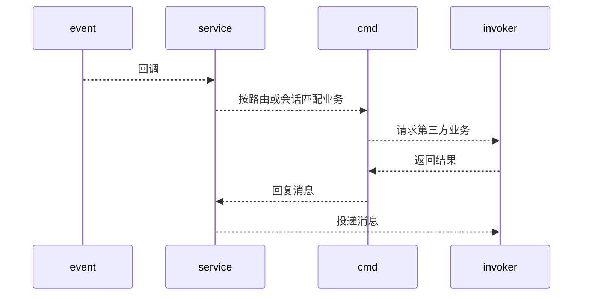

# eztalk


[](https://goreportcard.com/report/github.com/gowsp/eztalk)

一款简单的QQ频道机器人，具备如下功能：

- 讲笑话
- 猜谜语
- 猜字谜
- 脑筋急转弯

## 设计说明

### 模块说明

项目包含如下模块

- invoker：调用层，负责通讯以及消息解析，业务无关
- cmd：机器人指令集，包含机器
人指令实现，可通过实现 `Cmd` 扩展命令
- service：服务模块，接收消息通知，调用 `Cmd`
- event：websocket 消息监听模块，包含
  - 自鉴权
  - 心跳维护
  - 接收消息，回调 service
- bot 对外暴露机器人模块，支持添加扩展命令

### 启动流程

启动时模块调用关系大致如下



### 消息处理

当消息达到时，处理关系流程：



## 使用说明

根据操作系统类型从 [Release](https://github.com/gowsp/wsp/releases/latest) 下载相应程序并解压

复制`configs/config_template.json`配置文件为`configs/config.json`并按如下方式修改：

- 申请[木小果API](https://api.muxiaoguo.cn/)服务
  - 开通趣味问答，将获取的 `app_key` 替换 `/amusingQA` 后的 `xxxxxxxxx`
  - 开通随机笑话，将获取的 `app_key` 替换 `/xiaohua` 后的 `xxxxxxxxx`
- 替换`bot_`开头信息为申请的QQ机器人信息

`Windows`系统下 `cmd` 命令行中使用 `eztalk.exe -c configs/config.json` 启动

其他系统在命令行中使用 `./eztalk -c configs/config.json` 启动

### 下载使用

下载最新版本应用，

### 模块引用

开发时考虑到扩展使用需求，支持作为一个功能模块引入

```
go get -u github.com/gowsp/eztalk
```

可按如下方式添加自定义命令

```go
func TestCustomBot(t *testing.T) {
	bot := bot.New("xxx", "xxxxxx")
	bot.AddCmd(func(i *invoker.Invoker) cmd.Cmd { return &customCmd{} })
	bot.Start()
}

type customCmd struct {
	i *invoker.Invoker
}

func (c *customCmd) Id() []string                     { return []string{"/hello"} }
func (c *customCmd) Interactive() bool                { return false }
func (c *customCmd) Handle(cmd.Input) (string, error) { return "/world", nil }
func (c *customCmd) Reply(cmd.Input) string           { return "" }
```